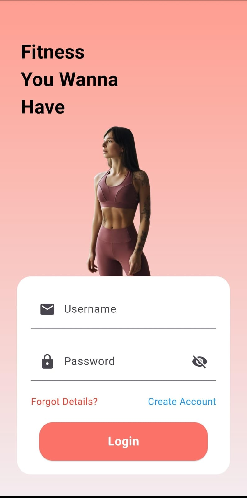
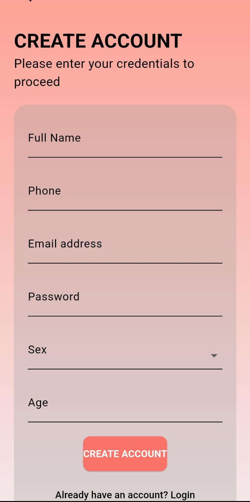
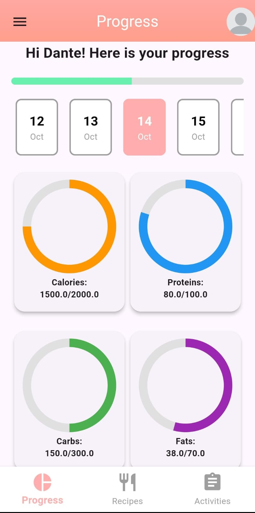
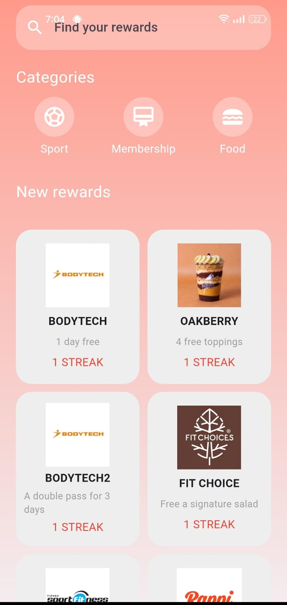
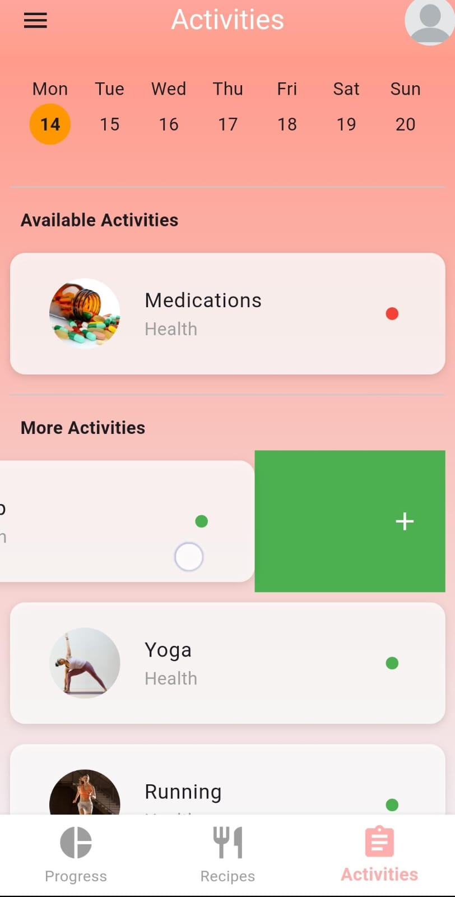

# My Health Tracker App
## Overview
My Health Tracker is a health and wellness application designed to help users track their daily water intake, nutrition goals, and activity levels while providing a rewarding gamification system to keep them motivated. The app uses SQLite for data persistence, ensuring that user progress, goals, and rewards are tracked and maintained even after logging out.

## Features
### 1. User Registration and Login
- Users can register with their personal details, such as name, email, phone number, gender, and age.
- Secure password storage.
- Profile picture defaults to a placeholder image but can be customized later.
  
   

### 2. Daily Nutrition Tracking
- Users can set daily nutrition goals for calories, proteins, carbohydrates, and fats.
- Real-time tracking of user progress based on daily consumption.
- If users meet their nutrition goals for two consecutive days, they earn credits.

  
  
### 3. Water Intake Tracking
- Track daily water intake with customizable glass sizes.
- Users can monitor progress throughout the day.
- Meeting water intake goals for two consecutive days earns users additional credits.

  
  
### 4. Gamification and Rewards System
- Users earn credits by meeting daily goals (nutrition, water) for consecutive days.
- A variety of rewards are available to claim using earned credits.
- Rewards range from free gym passes to shopping vouchers.
- Each claimed reward generates a unique code that the user can redeem.
- Claimed rewards are stored in the database, and users cannot reclaim the same reward unless the condition resets.

  
  
### 5. Activities Tracking
- Users can add, remove, and track activities such as yoga, running, or other health-related exercises.
- Activities are stored and associated with specific days, allowing users to look back at their progress over time.

  
  
### 6. Persistent Data Storage
- The app uses an SQLite database to store all user data, including progress, rewards, goals, and activities.
- Data is saved across sessions, allowing users to log in and pick up where they left off.
### 7. Credits System
- Credits are earned by consistently meeting health goals (nutrition and hydration).
- Users can redeem credits in a rewards store for various prizes.
- The redeemed rewards are stored in the database, ensuring they cannot be reclaimed.
### 8. Graphical UI with Gradients
- The app has a modern UI with gradient backgrounds, providing a visually pleasing user experience.
- Categories like "Sport", "Food", and "Membership" filter available rewards for easy navigation.
### 9. Error Handling and Warnings
- If users don't have enough credits to claim a reward, a warning message appears.
- If a reward is already claimed, users are notified to prevent duplicate claims.

## Database Structure
### The app uses an SQLite database with the following tables:
- Users: Stores user details, credits, and progress.
- Progress: Tracks daily nutrition information for each user.
- Goals: Stores nutrition goals for each day.
- Water: Logs daily water intake per user.
- Activities: Records user activities with associated dates.
- Redeemed Rewards: Keeps a record of all rewards redeemed by users.

## How to Use
- Register an account or log in with existing credentials.
- Set your nutrition and hydration goals for the day.
- Track your water and food intake throughout the day.
- Complete two consecutive days of goals to earn credits.
- Use earned credits in the reward store to claim exciting prizes.
- Stay motivated by tracking your progress with activities and rewards.

## Future Enhancements
- Adding social sharing to celebrate user achievements.
- Expanding reward categories and enhancing the variety of available rewards.

## Tecnologias utilizadas
-   Dart
-  Flutter
  
-   SQLite

  

## Demo del Proyecto

Puedes ver el video demo dando click [aquí](https://youtu.be/9PkSKAIBR9E).

